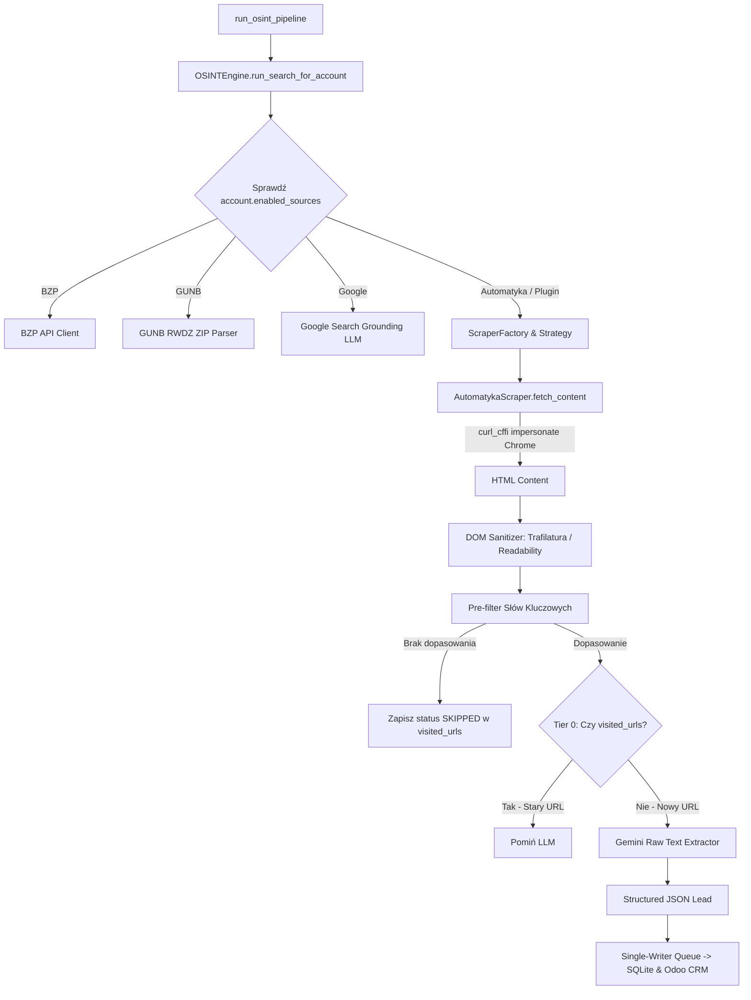

# Plan 017: Hybrydowa Architektura OSINT (Modularne Wtyczki + Deduplikacja Tier 0)

## [Goal Description]
Przekształcenie silnika OSINT (`src/osint_engine.py`) w rozszerzalną **Architekturę Hybrydową**. 
System umożliwi jednoczesną koegzystencję dotychczasowych potoków zasileń (**BZP API**, **GUNB RWDZ**, **Google Search Grounding**) z nowymi **Dedykowanymi Wtyczkami Skraperów** (np. `automatyka.pl`).

### Główne cele:
1. **Zero regresji**: Istniejące źródła BZP, GUNB oraz Google Search Grounding działają bez żadnych zmian.
2. **Deduplikacja Tier 0 (Pre-LLM)**: Tabela `visited_urls` w SQLite zapobiega pobieraniu i parsowaniu przez Gemini tych samych ogłoszeń (0 zbędnych zapytań HTTP/LLM).
3. **Czyszczenie DOM & Ochrona Tokenów**: Wykorzystanie bibliotek `trafilatura` oraz `readability` do agresywnego usuwania szumu DOM (nawigacje, reklamy, stopki) przed wysyłką do Gemini (skrócenie payloadu do czystego tekstu < 6KB).
4. **Bypass Anti-Bot**: Zastosowanie `curl_cffi` z podszywaniem się pod stos TLS Chrome/Firefox oraz asynchronicznego semafora (`asyncio.Semaphore`) z opóźnieniem jitter.
5. **Wzorzec Strategii w `OSINTEngine`**: Dynamiczne uruchamianie odpowiednich adapterów na podstawie pola `account.enabled_sources`.

---

## Architecture Overview



---

## User Review Required

> [!IMPORTANT]
> **Nowe zależności w `requirements.txt`**:
> Wdrożenie wymaga dodania dwóch pakietów:
> - `curl-cffi>=0.7.0` (dla podszywania się pod TLS Chrome/Firefox i omijania blokad Cloudflare)
> - `trafilatura>=1.12.0` (do automatycznej ekstrakcji czystego tekstu z HTML z pominięciem stopek i nawigacji)

> [!WARNING]
> **Kompatybilność danych w SQLite**:
> Nowa tabela `visited_urls` oraz tabela `scrapers` w bazie SQLite wymagają automatycznej migracji w `src/database.py`. Wszystkie operacje migracyjne są rozwijane jako nieblokujące i idempotentne (`CREATE TABLE IF NOT EXISTS`).

---

## Proposed Changes

### 1. Baza Danych & Modele (`src/models.py` & `src/database.py`)

#### [MODIFY] `src/models.py`
Dodanie modelu `VisitedURL` do obsługi deduplikacji Tier 0 oraz śledzenia stanu pobranych stron.

```python
class VisitedURL(Base):
    """Tabela deduplikacji Tier 0 dla skraperów dedykowanych."""
    __tablename__ = "visited_urls"

    url_hash = Column(String(64), primary_key=True)  # SHA-256 z kanonicznego URL
    url = Column(String(1000), nullable=False)
    account_id = Column(Integer, ForeignKey("accounts.id", ondelete="CASCADE"), nullable=False)
    source = Column(String(50), nullable=False)
    first_seen_at = Column(DateTime, nullable=False, default=datetime.utcnow)
    last_crawled_at = Column(DateTime, nullable=False, default=datetime.utcnow)
    content_hash = Column(String(64), nullable=True)
    status = Column(String(20), nullable=False, default="PROCESSED")  # PROCESSED, SKIPPED, FAILED
```

#### [MODIFY] `src/database.py`
1. Tworzenie tabeli `visited_urls` w funkcji `init_db()`.
2. Dodanie funkcji asynchronicznych:
   - `is_url_visited(url: str, account_id: int) -> bool`
   - `mark_url_visited(url: str, account_id: int, source: str, content_hash: Optional[str] = None, status: str = "PROCESSED") -> None`

---

### 2. Warstwa Wtyczek i Skraperów (`src/scrapers/`)

#### [NEW] `src/scrapers/__init__.py`
Eksport interfejsów i fabryki.

#### [NEW] `src/scrapers/base.py`
Definicja abstrakcyjnej klasy bazowej `BaseScraper` oraz czyszczenia tekstu DOM (`DOMSanitizer`).

```python
import abc
import logging
import re
from typing import List, Dict, Any
import trafilatura

logger = logging.getLogger(__name__)

class DOMSanitizer:
    @staticmethod
    def clean(html_content: str, max_chars: int = 6000) -> str:
        """Wyciąga czysty tekst z HTML używając Trafilatura i czyści szum."""
        if not html_content:
            return ""
        extracted = trafilatura.extract(
            html_content,
            include_links=True,
            include_tables=True,
            no_fallback=False
        )
        if not extracted:
            # Fallback regex cleaning
            text = re.sub(r"<(script|style|nav|footer|header|aside|iframe)[^>]*>.*?</\1>", "", html_content, flags=re.DOTALL | re.IGNORECASE)
            text = re.sub(r"<[^>]+>", " ", text)
            extracted = " ".join(text.split())
        
        return extracted[:max_chars].strip()

class BaseScraper(abc.ABC):
    """Abstrakcyjny interfejs dla dedykowanych wtyczek skraperów."""
    
    def __init__(self, source_name: str):
        self.source_name = source_name

    @abc.abstractmethod
    async def fetch_leads(self, account: Any, start_date: str, today_date: str) -> List[Dict[str, Any]]:
        """Pobiera i zwraca listę surowych lub wyekstrahowanych leadów."""
        pass
```

#### [NEW] `src/scrapers/automatyka.py`
Wtyczka dla portalu `automatyka.pl` przy użyciu `curl_cffi`.

```python
import logging
from typing import List, Dict, Any
from curl_cffi.requests import AsyncSession
from scrapers.base import BaseScraper, DOMSanitizer

logger = logging.getLogger(__name__)

class AutomatykaScraper(BaseScraper):
    def __init__(self):
        super().__init__(source_name="Automatyka")
        self.base_url = "https://www.automatyka.pl/zapytania-ofertowe"

    async def fetch_leads(self, account: Any, start_date: str, today_date: str) -> List[Dict[str, Any]]:
        raw_items = []
        async with AsyncSession(impersonate="chrome124") as session:
            try:
                resp = await session.get(self.base_url, timeout=15)
                if resp.status_code != 200:
                    logger.warning("[Automatyka] Błąd pobierania listy: %s", resp.status_code)
                    return []
                
                # Parsowanie listy ogłoszeń i linków szczegółowych...
                # Dla każdego nowego linku: fetch_detail + DOMSanitizer.clean()
            except Exception as e:
                logger.error("[Automatyka] Wyjątek podczas skanowania: %s", e)
        return raw_items
```

#### [NEW] `src/scrapers/factory.py`
Fabryka rejestrująca i udostępniająca aktywne wtyczki.

```python
from typing import Dict, Type
from scrapers.base import BaseScraper
from scrapers.automatyka import AutomatykaScraper

SCRAPER_REGISTRY: Dict[str, Type[BaseScraper]] = {
    "Automatyka": AutomatykaScraper,
}

def get_scraper_for_source(source_name: str) -> BaseScraper | None:
    cls = SCRAPER_REGISTRY.get(source_name)
    if cls:
        return cls()
    return None
```

---

### 3. Ekstraktor LLM & Modyfikacja Silnika (`src/osint_engine.py`)

#### [MODIFY] `src/osint_engine.py`
1. Dodanie metody `_extract_lead_from_raw_text(text: str, source_url: str, account: Any)` wywołującej Gemini z prostym promptem JSON-parsera (ekstrakcja z czystego tekstu bez Search Grounding).
2. Rozbudowa `run_search_for_account`:
   - Zachowanie wywołań BZP, GUNB, Google.
   - Dla pozostałych źródeł z `account.enabled_sources` (np. `"Automatyka"`), odpytanie `ScraperFactory.get_scraper_for_source()`.
   - Przetworzenie znalezionych unikalnych stron przez filtr Tier 0 (`is_url_visited`) oraz wywołanie Gemini Extractor.

---

### 4. Wdrożenie i Wymagania (`requirements.txt`)

#### [MODIFY] `requirements.txt`
```text
fastapi==0.115.5
uvicorn[standard]==0.32.1
pydantic-settings==2.6.1
apscheduler==3.10.4
aiosqlite==0.20.0
google-genai==1.16.0
SQLAlchemy>=2.0.0
curl-cffi>=0.7.0
trafilatura>=1.12.0
```

---

## Verification Plan

### Automated Tests
1. Test jednostkowy parsowania DOM (`test_dom_sanitizer.py`):
   - Weryfikacja usuwania stopek, menu i skryptów z przykładowego HTML-a.
2. Test jednostkowy `visited_urls` deduplikacji Tier 0.

### Manual Verification
1. Uruchomienie `PYTHONPATH=src python3 src/seed.py` i weryfikacja tabel SQLite.
2. Przypisanie źródła `"Automatyka"` do wybranego konta i wykonanie ręcznego skanu `POST /trigger-osint`.
3. Weryfikacja w sekcji `Logs` Dashboardu czy log pokazał wpis ze źródła `Automatyka` oraz czy zidentyfikowane leady poprawnie trafiły do Odoo CRM i kwarantanny.
