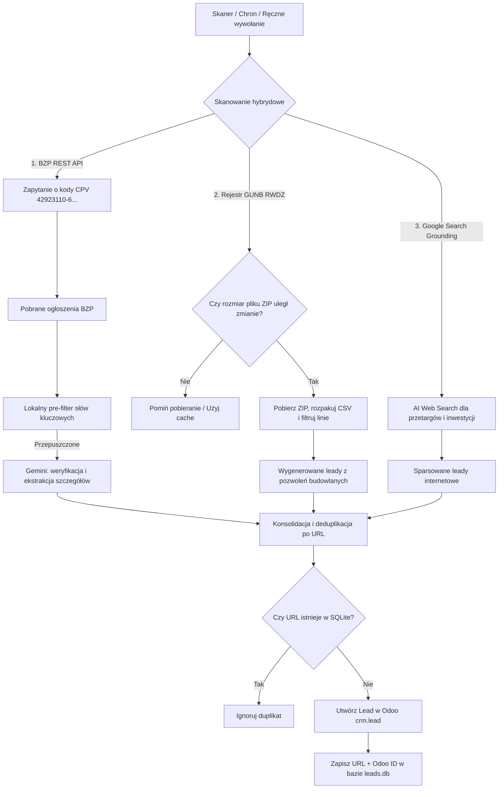

# OSINT Lead Tracker 🚀
> **AGENTS-OS v5.0 Swarm Edition**

Mikroserwis w Pythonie (FastAPI) automatyzujący wyszukiwanie i kwalifikację szans sprzedażowych (leadów) w branży wag samochodowych. Narzędzie łączy bezpośrednie odpytywanie rządowego API platformy **e-Zamówienia**, skanowanie rejestru pozwoleń na budowę **GUNB (RWDZ)** oraz przeszukiwanie szerokiego internetu za pomocą **Google Gemini 2.5 Flash (Search Grounding)**, po czym przesyła wyselekcjonowane i sformatowane rekordy do systemu **Odoo CRM**.

---

## 🏗️ Architektura Systemu

Poniższy diagram Mermaid przedstawia przepływ danych w potoku OSINT:



---

## 🌟 Kluczowe Funkcjonalności

1. **Hybrydowe Źródło Danych**:
   * **e-Zamówienia (Biuletyn Zamówień Publicznych)**: Bezpośrednie odpytywanie REST API dla kodów CPV związanych z wagami (np. `42923110-6` - wagi samochodowe, `42923000-2`, `42923200-0`). Zapewnia 100% wykrywalności i natychmiastowy dostęp do dokumentacji przetargowej.
   * **Główny Urząd Nadzoru Budowlanego (GUNB RWDZ)**: Pobieranie i parsing rejestrów wniosków i decyzji budowlanych z 16 województw w poszukiwaniu budowy stacjonarnych wag samochodowych/najazdowych.
   * **Google Search Grounding (Gemini)**: Przeszukiwanie szerszego internetu w poszukiwaniu komercyjnych zapytań ofertowych, przetargów niepublicznych i wiadomości inwestycyjnych.
2. **Optymalizacja Wydajności (GUNB Caching)**:
   * System wysyła lekkie zapytania `HEAD` w celu sprawdzenia `Content-Length` plików ZIP.
   * Pobieranie danych następuje tylko wtedy, gdy baza urzędu uległa aktualizacji, co oszczędza ponad 350 MB transferu przy rutynowych skanach.
3. **Kwalifikacja przez Gemini 2.5 Flash**:
   * Zabezpieczenie przed przeterminowanymi lub rozstrzygniętymi zamówieniami.
   * Odczyt dokładnych parametrów (zakres, nośność wagi) z treści ogłoszeń.
   * Automatyczna ocena priorytetu biznesowego (wysoki/średni/niski).
4. **Formatowanie HTML w Odoo**:
   * Tworzenie przejrzystych tabel szczegółowych na karcie leada w Odoo.
   * Generowanie bezpośrednich, poprawnie zakodowanych linków publicznych do ogłoszeń e-Zamówień i wniosków GUNB.
5. **Deduplikacja i Bezpieczeństwo**:
   * Unikalny indeks URL w bazie SQLite uniemożliwia wielokrotne tworzenie tej samej szansy w CRM.
   * Autoryzacja żądań tokenem nagłówkowym `X-API-Token`.

---

## ⚙️ Konfiguracja Środowiska (`.env`)

Aplikacja konfiguruje się automatycznie za pomocą Pydantic Settings na podstawie pliku `.env`:

```env
# --- AI ---
GEMINI_API_KEY="twój-klucz-api-gemini"

# --- Odoo XML-RPC ---
ODOO_URL="https://twoje-odoo.pl"
ODOO_DB="nazwa_bazy_odoo"
ODOO_USER="twoj_login_odoo"
ODOO_API_KEY="twój_klucz_api_odoo"
ODOO_TEAM_ID=0         # Opcjonalne: ID zespołu sprzedaży w Odoo
ODOO_SOURCE_ID=0       # Opcjonalne: ID źródła pozyskania leada

# --- API Security ---
API_TOKEN="silny-token-zabezpieczajacy-api"

# --- Database ---
DATABASE_URL="sqlite:///./data/leads.db"
SQLITE_PATH="./data/leads.db"

# --- APScheduler ---
CRON_HOUR=6
CRON_MINUTE=0
CRON_TIMEZONE="Europe/Warsaw"
```

---

## 🔌 Endpointy API

Aplikacja udostępnia interaktywną dokumentację Swagger pod adresem `/docs` oraz ReDoc pod `/redoc`.

### 1. `GET /health`
Liveness probe zwracający stan działania mikroserwisu oraz datę kolejnego automatycznego skanu.
* **Autoryzacja**: Brak.
* **Przykładowa odpowiedź**:
  ```json
  {
    "status": "ok",
    "service": "osint-lead-tracker",
    "version": "1.0.0",
    "scheduler": "running",
    "next_run": "2026-07-14T06:00:00+02:00"
  }
  ```

### 2. `POST /trigger-osint`
Wymusza natychmiastowe uruchomienie potoku OSINT.
* **Autoryzacja**: Nagłówek `X-API-Token` (zgodny z `API_TOKEN`).
* **Przykładowa odpowiedź**:
  ```json
  {
    "triggered": true,
    "stats": {
      "found": 1,
      "new": 1,
      "duplicates": 0,
      "odoo_ok": 1,
      "odoo_fail": 0
    }
  }
  ```

### 3. `GET /leads`
Zwraca ostatnie N przetworzonych leadów zapisanych w bazie SQLite.
* **Autoryzacja**: Nagłówek `X-API-Token`.
* **Parametry**: `limit` (opcjonalny, domyślnie 50, zakres 1-500).

---

## 🛠️ Uruchomienie lokalne i Wdrożenie (Docker Compose)

### 1. Budowanie i start kontenera
```bash
docker compose up -d --build
```

### 2. Odczyt bazy SQLite z poziomu hosta VPS
Baza danych znajduje się na zamontowanym wolumenie. Ponieważ obraz `python:slim` nie posiada domyślnie klienta `sqlite3`, odpytanie bazy najwygodniej wykonać jednolinijkowcem Pythona:
```bash
docker exec osint-lead-tracker python3 -c "import sqlite3; [print(r) for r in sqlite3.connect('./data/leads.db').cursor().execute('SELECT id, tytul, priorytet, created_at FROM leads')]"
```
