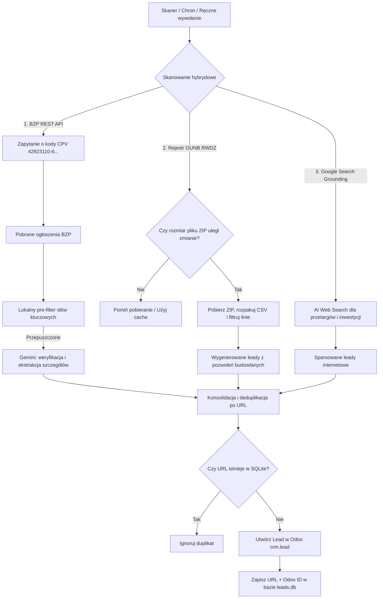

# OSINT Lead Tracker 🚀
> **AGENTS-OS v5.0 Swarm Edition**

Mikroserwis w Pythonie (FastAPI) automatyzujący wyszukiwanie i kwalifikację szans sprzedażowych (leadów) w branży wag samochodowych. Narzędzie łączy bezpośrednie odpytywanie rządowego API platformy **e-Zamówienia**, skanowanie rejestru pozwoleń na budowę **GUNB (RWDZ)** oraz przeszukiwanie szerokiego internetu za pomocą **Google Gemini 2.5 Flash (Search Grounding)**, po czym przesyła wyselekcjonowane i sformatowane rekordy do systemu **Odoo CRM**.

---

## 🏗️ Architektura Systemu

Poniższy diagram Mermaid przedstawia przepływ danych w potoku OSINT:



---

## 🌟 Kluczowe Funkcjonalności

1. **Hybrydowe Źródło Danych**:
   * **e-Zamówienia (Biuletyn Zamówień Publicznych)**: Bezpośrednie odpytywanie REST API dla kodów CPV związanych z wagami (np. `42923110-6` - wagi samochodowe, `42923000-2`, `42923200-0`). Zapewnia 100% wykrywalności i natychmiastowy dostęp do dokumentacji przetargowej.
   * **Główny Urząd Nadzoru Budowlanego (GUNB RWDZ)**: Pobieranie i parsing rejestrów wniosków i decyzji budowlanych z 16 województw w poszukiwaniu budowy stacjonarnych wag samochodowych/najazdowych.
   * **Google Search Grounding (Gemini)**: Przeszukiwanie szerszego internetu w poszukiwaniu komercyjnych zapytań ofertowych, przetargów niepublicznych i wiadomości inwestycyjnych.
2. **Optymalizacja Wydajności (GUNB Caching)**:
   * System wysyła lekkie zapytania `HEAD` w celu sprawdzenia `Content-Length` plików ZIP.
   * Pobieranie danych następuje tylko wtedy, gdy baza urzędu uległa aktualizacji, co oszczędza ponad 350 MB transferu przy rutynowych skanach.
3. **Kwalifikacja przez Modele Gemini (2.5 Flash / 2.5 Pro)**:
   * Dynamiczna parametryzacja modelu LLM, temperatury i max tokens na poziomie każdej kampanii.
   * Zabezpieczenie przed przeterminowanymi lub rozstrzygniętymi zamówieniami.
   * Ekstrakcja kluczowych danych (zakres wagi, typ, dane inwestora) i ocena priorytetu biznesowego.
4. **Formatowanie HTML i Mapowanie Odoo Multicompany**:
   * Tworzenie przejrzystych tabel szczegółowych na karcie leada w Odoo CRM.
   * Przypisywanie leadów do właściwych spółek (`company_id`), handlowców (`user_id`), zespołów (`team_id`), źródeł (`source_id`) oraz tagów (`tag_ids`) dynamicznie na podstawie kampanii.
5. **Dedykowany Rejestr "Twardych Dowodów" i Analityka KPI**:
   * Zapisywanie szczegółowych logów z unikalnym skrótem SHA-256 surowej odpowiedzi z API.
   * Wykresy i metryki KPI obrazujące liczbę skanów, współczynnik sukcesu LLM oraz wykryte błędy w czasie.
   * Notification Gate powiadamiający w czasie rzeczywistym o błędach autoryzacji Odoo lub statusach 4xx/5xx w logach API.
6. **Wersjonowanie i Historia Promptów Systemowych (Faza 5)**:
   * Pełna historia zmian promptów per kampania.
   * Statystyki efektywności i konwersji (lead count, won count, rate %) powiązane z konkretną wersją promptu.
   * Opcja błyskawicznego przywrócenia (restore) wybranego promptu z poziomu UI.
7. **Deduplikacja i Bezpieczeństwo**:
   * Unikalny indeks URL w bazie SQLite uniemożliwia wielokrotne tworzenie tej samej szansy w CRM.
   * Autoryzacja sesyjna panelu oraz tokenowa (`X-API-Token`) dla zewnętrznych wywołań.
   * Wbudowane maskowanie kluczy API i haseł przed wyciekiem w logach i czatach.
8. **Bezpiecznik Kwarantanny (Circuit Breaker & Single Writer)**:
   * Limit `MAX_LEADS_PER_RUN` zabezpieczający Odoo CRM przed zatruciem fałszywymi lub zduplikowanymi danymi. Leady z anomaliami przekierowywane są do kwarantanny UI w celu ręcznej weryfikacji.
   * Asynchroniczna kolejka zapisu SQLite (Single Writer Queue) zapobiegająca błędowi `database is locked`.
9. **Konfigurowalne Źródła i Okno Czasowe (Faza 7)**:
   * Przełączniki aktywnych źródeł OSINT (e-Zamówienia BZP, GUNB RWDZ, Wyszukiwarka Google) per kampania.
   * Rozszerzone okno skanowania `SEARCH_WINDOW_DAYS` (domyślnie 7 dni roboczych).

---

## ⚙️ Konfiguracja Środowiska (`.env`)

Aplikacja konfiguruje się automatycznie za pomocą Pydantic Settings na podstawie pliku `.env`:

```env
# --- AI ---
GEMINI_API_KEY="twój-klucz-api-gemini"

# --- Odoo XML-RPC ---
ODOO_URL="https://twoje-odoo.pl"
ODOO_DB="nazwa_bazy_odoo"
ODOO_USER="twoj_login_odoo"
ODOO_API_KEY="twój_klucz_api_odoo"
ODOO_TEAM_ID=0         # Opcjonalne: ID zespołu sprzedaży w Odoo
ODOO_SOURCE_ID=0       # Opcjonalne: ID źródła pozyskania leada

# --- API Security ---
API_TOKEN="silny-token-zabezpieczajacy-api"

# --- Database ---
DATABASE_URL="sqlite:///./data/leads.db"
SQLITE_PATH="./data/leads.db"

# --- APScheduler & Pipeline ---
CRON_HOUR=6
CRON_MINUTE=0
CRON_TIMEZONE="Europe/Warsaw"
SEARCH_WINDOW_DAYS=7   # Opcjonalne: Liczba dni roboczych wstecz przy skanowaniu (domyślnie 7)
```

> [!NOTE]
> Parametry mapowania Odoo takie jak **Odoo Company ID** (`odoo_company_id`), **Odoo User ID / Handlowiec** (`odoo_user_id`), **Odoo Tag IDs** (`odoo_tag_ids`), a także dedykowane parametry **Team ID** (`odoo_team_id`) i **Source ID** (`odoo_source_id`) są konfigurowane **dynamicznie w panelu graficznym (zakładka Accounts)** osobno dla każdej kampanii (Account). Zapisywane są one w bazie danych SQLite. Zmienne `ODOO_TEAM_ID` i `ODOO_SOURCE_ID` w pliku `.env` pełnią jedynie rolę opcjonalnych domyślnych wartości (fallbacks).

---

## 🔌 Endpointy API

Aplikacja udostępnia interaktywną dokumentację Swagger pod adresem `/docs` oraz ReDoc pod `/redoc`.

### 1. `GET /health`
Liveness probe zwracający stan działania mikroserwisu oraz datę kolejnego automatycznego skanu.
* **Autoryzacja**: Brak.
* **Przykładowa odpowiedź**:
  ```json
  {
    "status": "ok",
    "service": "osint-lead-tracker",
    "version": "1.7.2",
    "scheduler": "running",
    "next_run": "2026-07-15T06:00:00+02:00"
  }
  ```

### 2. `POST /trigger-osint`
Wymusza natychmiastowe uruchomienie potoku OSINT.
* **Autoryzacja**: Nagłówek `X-API-Token` (zgodny z `API_TOKEN`) lub aktywna sesja administratora.
* **Przykładowa odpowiedź**:
  ```json
  {
    "triggered": true,
    "stats": {
      "found": 1,
      "new": 1,
      "duplicates": 0,
      "odoo_ok": 1,
      "odoo_fail": 0
    }
  }
  ```

### 3. `GET /api/leads`
Zwraca ostatnie N przetworzonych leadów zapisanych w bazie SQLite (endpoint sesyjnie zabezpieczony na potrzeby UI).
* **Autoryzacja**: Aktywna sesja administratora.
* **Parametry**: `limit` (opcjonalny, domyślnie 100).

### 4. `GET /api/analytics/kpis`
Zwraca zagregowane dane statystyczne KPI (współczynnik sukcesu LLM, łączna liczba skanów, błędy API).
* **Autoryzacja**: Aktywna sesja administratora.

### 5. `GET /api/analytics/timeline`
Zwraca statystyki wyszukiwań i nowych leadów na osi czasu.
* **Autoryzacja**: Aktywna sesja administratora.

### 6. `GET /api/analytics/prompts`
Zwraca historię modyfikacji promptów wraz ze wskaźnikami konwersji i sprzedaży CRM.
* **Autoryzacja**: Aktywna sesja administratora.

### 7. `POST /api/leads/sync-crm`
Uruchamia ręczną synchronizację statusów szans z Odoo.
* **Autoryzacja**: Aktywna sesja administratora.

### 8. `GET /api/analytics/dashboard`
Zwraca statystyki wydajności (Yield 7d, Yield per Chunk, zapytania Google Grounding, zużycie tokenów input/output oraz zdarzenia kwarantanny Circuit Breaker).
* **Autoryzacja**: Aktywna sesja administratora.

### 9. `GET /api/leads/pending`
Zwraca listę leadów zatrzymanych w kwarantannie przez Circuit Breaker (oczekujących na zatwierdzenie).
* **Autoryzacja**: Aktywna sesja administratora.

### 10. `POST /api/leads/{lead_id}/approve`
Zatwierdza lead z kwarantanny, przesyła go do odpowiedniej firmy w Odoo CRM na podstawie mapowania kampanii i oznacza jako zaakceptowany.
* **Autoryzacja**: Aktywna sesja administratora.

---

## 🛠️ Uruchomienie lokalne i Wdrożenie (Docker Compose)

### 1. Budowanie i start kontenera
```bash
docker compose up -d --build
```

### 2. Odczyt bazy SQLite z poziomu hosta VPS
Baza danych znajduje się na zamontowanym wolumenie. Ponieważ obraz `python:slim` nie posiada domyślnie klienta `sqlite3`, odpytanie bazy najwygodniej wykonać jednolinijkowcem Pythona:
```bash
docker exec osint-lead-tracker python3 -c "import sqlite3; [print(r) for r in sqlite3.connect('./data/leads.db').cursor().execute('SELECT id, tytul, priorytet, created_at FROM leads')]"
```
