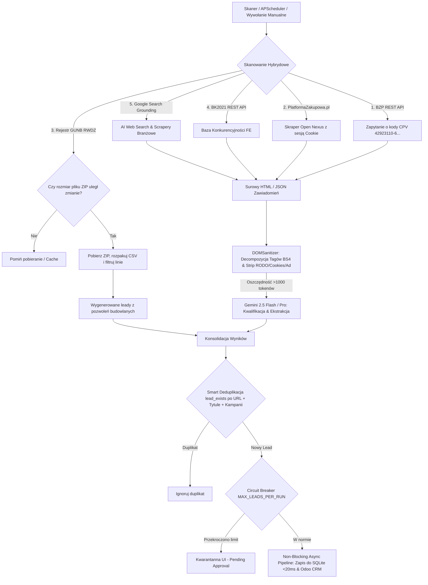

# OSINT Lead Tracker 🚀
> **AGENTS-OS v5.0 Swarm Edition** (Wersja v1.7.46)

Mikroserwis w Pythonie (FastAPI) automatyzujący wyszukiwanie i kwalifikację szans sprzedażowych (leadów) w branży wag samochodowych i przemysłowych. Narzędzie łączy bezpośrednie odpytywanie rządowych i komercyjnych platform przetargowych (**e-Zamówienia**, **PlatformaZakupowa.pl**, **Baza Konkurencyjności BK2021**), skanowanie rejestru pozwoleń na budowę **GUNB (RWDZ)** oraz przeszukiwanie szerokiego internetu za pomocą **Google Gemini 2.5 Flash (Search Grounding)**, po czym przesyła wyselekcjonowane i sformatowane rekordy do systemu **Odoo CRM**.

---

## 🏗️ Architektura Systemu

Poniższy diagram Mermaid przedstawia przepływ danych i kluczowe moduły w potoku OSINT v1.7.46:


```mermaid
graph TD
    A[Skaner / APScheduler / Wywołanie Manualne] --> B{Skanowanie Hybrydowe}

    B -->|1. BZP REST API| C[Zapytanie o kody CPV 42923110-6...]
    B -->|2. PlatformaZakupowa.pl| D[Skraper Open Nexus z sesją Cookie]
    B -->|3. Rejestr GUNB RWDZ| E{Czy rozmiar pliku ZIP uległ zmianie?}
    B -->|4. BK2021 REST API| F[Baza Konkurencyjności FE]
    B -->|5. Google Search Grounding| G[AI Web Search & Scrapery Branżowe]

    E -->|Nie| H[Pomiń pobieranie / Cache]
    E -->|Tak| I[Pobierz ZIP, rozpakuj CSV i filtruj linie]

    C --> J[Surowy HTML / JSON Zawiadomień]
    D --> J
    F --> J
    G --> J

    J --> K[DOMSanitizer: Decompozycja Tagów BS4 & Strip RODO/Cookies/Ad]
    K -->|Oszczędność >1000 tokenów| L[Gemini 2.5 Flash / Pro: Kwalifikacja & Ekstrakcja]

    I --> M[Wygenerowane leady z pozwoleń budowlanych]
    L --> N[Konsolidacja Wyników]
    M --> N

    N --> O{Smart Deduplikacja lead_exists po URL + Tytule + Kampanii}
    O -->|Duplikat| P[Ignoruj duplikat]
    O -->|Nowy Lead| Q{Circuit Breaker MAX_LEADS_PER_RUN}

    Q -->|Przekroczono limit| R[Kwarantanna UI - Pending Approval]
    Q -->|W normie| S[Non-Blocking Async Pipeline: Zapis do SQLite <20ms & Odoo CRM]
```

### Kluczowe założenia architektoniczne:
- **Non-Blocking Async Event Loop Protection**: Przetwarzanie skanowania i zapis kampanii w odrębnym wątku/kolejce (`asyncio.to_thread` / Single Writer Queue), co gwarantuje natychmiastową reaktywność panelu UI (<20ms na zapis ustawień/kampanii).
- **DOMSanitizer z Decompozycją Tagów BS4**: Strukturalne usuwanie węzłów Vue/React, modali zgodności RODO, banerów ciasteczek oraz widżetów reklamowych przy użyciu `BeautifulSoup4` przed przekazaniem kontekstu do LLM (zmniejszenie zużycia tokenów wejściowych o ponad 1,000 tokenów na zapytanie).
- **Uniwersalny Skaner Spójności Zależności (`dependency_checker.py`)**: Automatyczny moduł sprawdzający spójność i obecność 11 pakietów systemowych (m.in. `curl_cffi`, `bs4`, `playwright`, `fastapi`, `sqlalchemy`) z automatycznym raportowaniem banerów ostrzegawczych/krytycznych w `/health`.

---

## 🌟 Kluczowe Funkcjonalności

1. **Hybrydowe Źródła Danych & Skrapery Dedykowane**:
   * **e-Zamówienia (Biuletyn Zamówień Publicznych)**: Bezpośrednie odpytywanie REST API dla kodów CPV związanych z wagami (np. `42923110-6` - wagi samochodowe, `42923000-2`, `42923200-0`). Zapewnia 100% wykrywalności przetargów publicznych.
   * **PlatformaZakupowa.pl (Open Nexus)**: Dedykowany skraper hybrydowy z bezpieczną inicjalizacją i utrzymywaniem sesji cookie, pozwalający na sprawne pobieranie postępowań przetargowych z platformy Open Nexus.
   * **Baza Konkurencyjności (BK2021)**: Asynchroniczne odpytywanie portalu BK2021 z głęboką ekstrakcją zagnieżdżonych danych kontaktowych oferentów.
   * **Główny Urząd Nadzoru Budowlanego (GUNB RWDZ)**: Parsing rejestrów wniosków i decyzji budowlanych z 16 województw dla stacjonarnych wag samochodowych/najazdowych.
   * **Google Search Grounding (Gemini)**: Przeszukiwanie sieci w poszukiwaniu komercyjnych zapytań ofertowych i przetargów niepublicznych.
2. **Dekompozycja Tagów DOM i Czyszczenie Banerów (`DOMSanitizer`)**:
   * Zaawansowany parser HTML oparty na `BeautifulSoup4` i fallbackowych wyrażeniach regularnych.
   * Fizyczne odcinanie i decompozycja tagów nawigacji, skryptów, modali RODO/Cookie, skryptów śledzących oraz banerów reklamowych.
   * Redukcja rozmiaru promptu do LLM o **ponad 1000 tokenów** na zapytanie przy zachowaniu 100% kluczowej treści merytorycznej zawiadomień.
3. **Uniwersalny Skaner Spójności Zależności (`dependency_checker.py`)**:
   * Integracyjny skaner weryfikujący stan 11 kluczowych bibliotek i modułów w czasie uruchamiania aplikacji i podczas wywołania `/health`.
   * Prezentacja czytelnych banerów statusu (`OK`, `WARNING`, `CRITICAL`) w logach konsoli i API.
4. **Paginacja Logów Badawczych i Leadów z Filtrowaniem 10+ Źródeł**:
   * Wydajna paginacja logów w panelu (`ResearchLog` - 50 wpisów / stronę) oraz leadów (10 wpisów / stronę).
   * Filtracja po 10 źródłach danych: `PlatformaZakupowa`, `Logintrade`, `Automatyka`, `BiznesPolska`, `BazaKonkurenconosci`, `Ezamowienia`, `BZP`, `GUNB`, `GoogleGrounding`, itp.
   * Dedykowane filtrowanie po konkretnych kampaniach/kontach (`account_id`).
5. **Interaktywny Skalowalny Wykres Trendów SVG (Dashboard Analytics)**:
   * Dynamiczny wykres osi czasu porównujący skanowania vs wykryte leady z pełnym wsparciem skalowalności SVG.
   * Przełączniki zakresu czasowego w czasie rzeczywistym: `1D`, `7D`, `1M`, `3M`, `6M`, `1Y`, `5Y`, `Wszystkie`.
6. **Zaawansowana Deduplikacja (`lead_exists`) & Non-Blocking Async Pipeline**:
   * Wielopoziomowa deduplikacja po kanonicznym URL, tytule oraz identyfikatorze kampanii (`lead_exists`), zapobiegająca ponownemu przetwarzaniu tych samych szans.
   * Asynchroniczny pipeline zapisu kampanii (<20ms) z izolacją operacji dyskowych i zapobieganiem blokowaniu pętli zdarzeń Event Loop (`asyncio.to_thread` oraz `Single Writer Queue` w SQLite).
7. **Kwalifikacja przez Modele Gemini (2.5 Flash / 2.5 Pro)**:
   * Dynamiczna parametryzacja modelu LLM, temperatury i max tokens per kampania.
   * Ekstrakcja typu wagi, lokalizacji, inwestora, zakresu oraz ocena priorytetu biznesowego.
8. **Formatowanie HTML i Mapowanie Odoo Multicompany**:
   * Generowanie estetycznych tabel HTML na karcie leada w Odoo CRM.
   * Mapowanie spółek (`company_id`), opiekunów (`user_id`), zespołów (`team_id`), źródeł (`source_id`) oraz tagów (`tag_ids`) na poziomie kampanii.
9. **Wersjonowanie Promptów & Bezpiecznik Kwarantanny (Circuit Breaker)**:
   * Wersjonowanie i przywracanie promptów systemowych z analityką konwersji (lead count, won count).
   * Kwarantanna UI (`pending_approval`) chroniąca Odoo CRM w przypadku nagłego skoku liczby znalezionych wyników (`MAX_LEADS_PER_RUN`).
10. **Fleksja Języka Polskiego i Automatyczna Ekspansja Słów Kluczowych**:
    * Parser bliskości tematów (stems) dopasowujący odmiany gramatyczne polskich słów kluczowych.
    * Automatyczna generacja synonimów i ekspansja słów kluczowych przez Gemini 2.5 Flash.

---

## ⚙️ Konfiguracja Środowiska (`.env`)

Aplikacja konfiguruje się automatycznie za pomocą Pydantic Settings na podstawie pliku `.env`:

```env
# --- AI ---
GEMINI_API_KEY="twój-klucz-api-gemini"

# --- Odoo XML-RPC ---
ODOO_URL="https://twoje-odoo.pl"
ODOO_DB="nazwa_bazy_odoo"
ODOO_USER="twoj_login_odoo"
ODOO_API_KEY="twój_klucz_api_odoo"
ODOO_TEAM_ID=0         # Opcjonalne: ID zespołu sprzedaży w Odoo (fallback)
ODOO_SOURCE_ID=0       # Opcjonalne: ID źródła pozyskania leada (fallback)

# --- API Security ---
API_TOKEN="silny-token-zabezpieczajacy-api"

# --- Database ---
DATABASE_URL="sqlite+aiosqlite:///./data/leads.db"
SQLITE_PATH="./data/leads.db"

# --- APScheduler & Pipeline ---
CRON_HOUR=6
CRON_MINUTE=0
CRON_TIMEZONE="Europe/Warsaw"
SEARCH_WINDOW_DAYS=7   # Liczba dni roboczych wstecz przy skanowaniu
```

---

## 🔌 Endpointy API

Aplikacja udostępnia interaktywną dokumentację Swagger pod adresem `/docs` oraz ReDoc pod `/redoc`.

### 1. `GET /health`
Liveness probe zwracający stan działania mikroserwisu, datę kolejnego automatycznego skanu, status sanityzatora DOM oraz pełny raport spójności zależności.
* **Autoryzacja**: Brak.
* **Przykładowa odpowiedź**:
  ```json
  {
    "status": "ok",
    "system_status": "OK",
    "service": "osint-lead-tracker",
    "version": "1.7.50",
    "scheduler": "running",
    "next_run": "2026-08-01T06:00:00+02:00",
    "sanitizer": {
      "bs4_available": true,
      "mode": "bs4_decomp_fallback_regex"
    },
    "dependencies": {
      "status": "OK",
      "total_packages": 11,
      "installed": 11,
      "missing": 0,
      "packages": [ ... ]
    }
  }
  ```

### 2. `POST /trigger-osint`
Wymusza natychmiastowe uruchomienie potoku OSINT.
* **Autoryzacja**: Nagłówek `X-API-Token` (zgodny z `API_TOKEN`) lub aktywna sesja administratora.
* **Przykładowy parametr**: `account_id` (opcjonalny ID kampanii).

### 3. `GET /api/leads`
Zwraca stronicowaną listę przetwarzanych leadów w SQLite.
* **Autoryzacja**: Aktywna sesja administratora.
* **Parametry**: `page` (domyślnie 1), `limit` (domyślnie 10), `account_id` (opcjonalny).

### 4. `GET /api/logs`
Zwraca stronicowaną listę logów badawczych z filtrowaniem po źródłach i kampaniach.
* **Autoryzacja**: Aktywna sesja administratora.
* **Parametry**: `page` (domyślnie 1), `limit` (domyślnie 50), `source` (`PlatformaZakupowa`, `Logintrade`, `BZP`, itp.), `account_id`.

### 5. `GET /api/analytics/timeline`
Zwraca statystyki skanowań i leadów na osi czasu do generowania skalowalnego wykresu SVG.
* **Autoryzacja**: Aktywna sesja administratora.
* **Parametry**: `range` (`1D`, `7D`, `1M`, `3M`, `6M`, `1Y`, `5Y`, `ALL`).

### 6. `GET /api/analytics/dashboard`
Zwraca kluczowe metryki KPI (Yield 7d, Token Economy - input/output, zapytania Grounding, błędy API oraz zdarzenia kwarantanny Circuit Breaker).
* **Autoryzacja**: Aktywna sesja administratora.

### 7. `GET /api/leads/pending` & `POST /api/leads/{lead_id}/approve`
Obsługa leadów zatrzymanych w kwarantannie Circuit Breakers (podgląd i zatwierdzanie do Odoo CRM).
* **Autoryzacja**: Aktywna sesja administratora.

---

## 🛠️ Uruchomienie lokalne i Wdrożenie (Docker Compose)

### 1. Budowanie i start kontenera
```bash
docker compose up -d --build
```

### 2. Szybki odczyt bazy SQLite z poziomu hosta VPS
```bash
docker exec osint-lead-tracker python3 -c "import sqlite3; [print(r) for r in sqlite3.connect('./data/leads.db').cursor().execute('SELECT id, tytul, priorytet, created_at FROM leads ORDER BY id DESC LIMIT 10')]"
```
